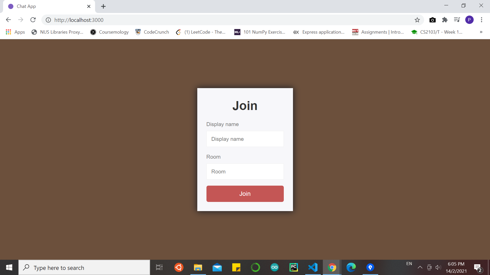
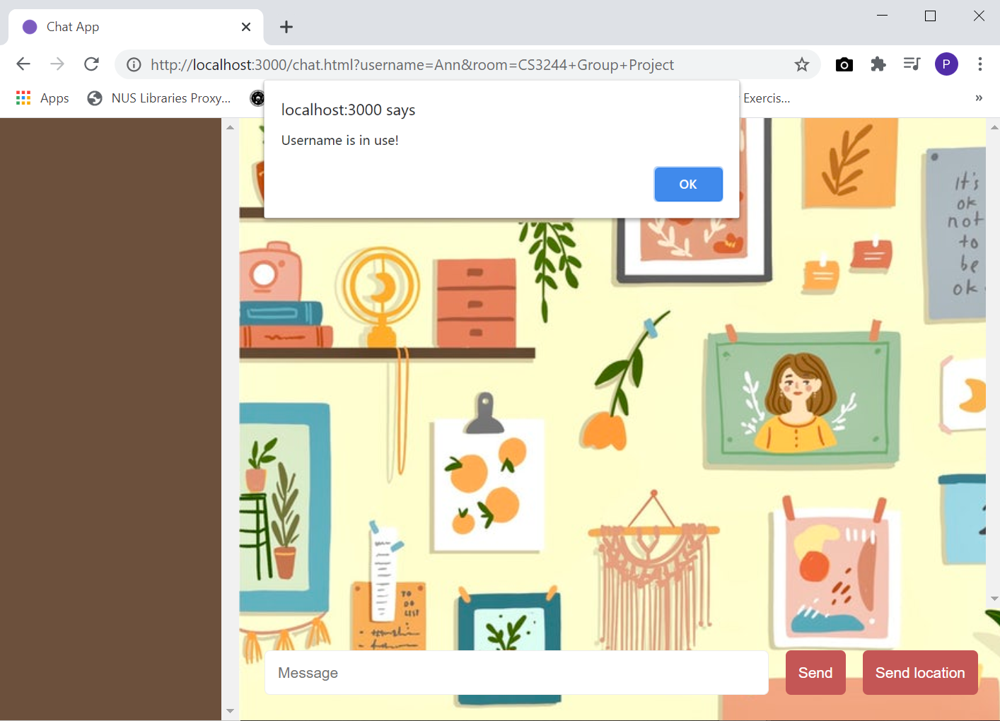
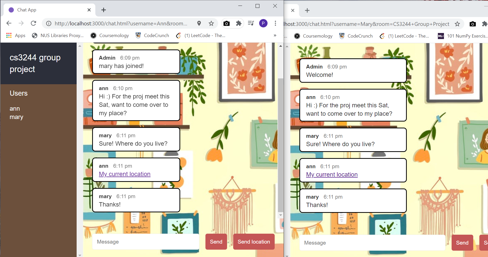

# Chat-App
Chat application created using Node.js and Socket.IO

### Joining a Room
To join a chat room, users can specify their usernames and the name of the chat room. Basic validation is performed to ensure that usernames of users in the same chat room
are unique.

### Sending Messages
Once the user has successfully joined the chat room, the admin will inform all other users in the chat room that a new user has joined. The user can then send messages
to all users in the same chat room. Users in other chat rooms cannot see these messages.

As new messages are sent to the chat room, the message page automatically scrolls down to the bottom so that users can view the most recent messages. However, automatic
scrolling will be disabled if the user scrolls elsewhere to the top, in case the user wishes to look at older messages. When the user has returned to the bottom to look at
new messages, automatic scrolling will be enabled.

The chat room features a sidebar that shows the name of the chat room, as well as the usernames of all active users. This username list automatically updates itself whenever
new users enter the chat room, or existing users leave.

### Sending Location
The app has a feature that allows users to share their current location, simply by clicking the 'Send location' button. A link to Google Maps (with a pin dropped on the user's
location) will be sent to all users.

### Leaving a Room
When a user leaves the chat room, the admin will inform all other users in the chat room that the user has left.

